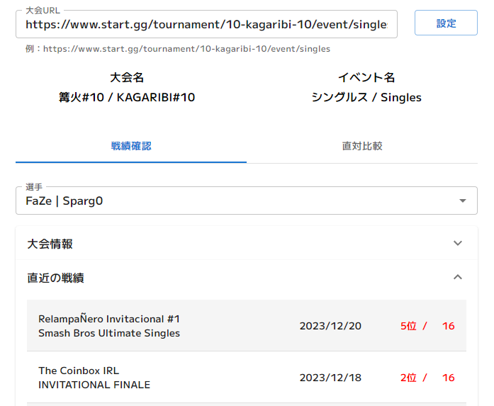
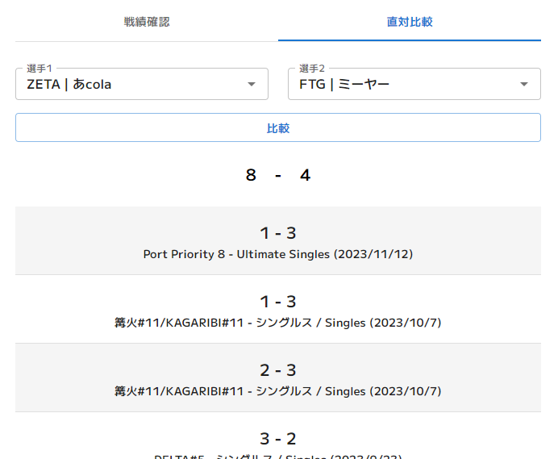

# Smash Tracker


# 概要



ある選手の大会情報や直近の成績、直対の結果を見ることができます

# 目次
<!-- TOC -->
* [インストール方法](#インストール方法)
  * [Chrome / Vivaldi / Microsoft Edge / Opera など](#chrome--vivaldi--microsoft-edge--opera-など)
  * [Firefox](#firefox)
* [使い方](#使い方)
  * [メイン](#メイン)
  * [戦績確認タブ](#戦績確認タブ)
  * [直対比較タブ](#直対比較タブ)
* [コンタクト](#コンタクト)
* [開発者向け](#開発者向け)
<!-- TOC -->

# インストール方法
> [!WARNING]
> 本拡張機能のインストールには開発者モードを使用します  
> 作者が問題がないことを確認していますが、本拡張機能の使用に対して、作者は責任を負いかねます  
> 心配な方はご自身でビルドしたのちにインストールするようお願いいたします

## Chrome / Vivaldi / Microsoft Edge / Opera など
1. https://github.com/yadokari1130/Smash-Tracker/releases/latest から`SmashTracker_Chrome.zip`をダウンロードします
2. `SmashTracker_Chrome.zip`を好きな場所に解凍します
3. [chrome://extensions](chrome://extensions)にアクセスします
4. 開発者モード(デベロッパーモード)が有効になっていない場合は有効にします
5. 「パッケージ化されていない拡張機能を読み込む」を押し、解凍したファイルを選択します
6. https://dev.start.gg/docs/authentication/ を参考に、APIキーを取得します  
> [!CAUTION]
> なお、このAPIキーがあればstart.ggのアカウントを操作することができるため、他人に教えたりせず、取り扱いには十分注意してください
7. 拡張機能のポップアップ画面上部の「APIキー」に入力します

## Firefox
準備中です。

# 使い方
## メイン
### APIキー
start.ggのAPIキーを入力します
### 大会URL
start.ggのURLを入力します
### 設定
入力したURLを設定し、その大会の情報を取得します
### 大会名
設定した大会の名前が表示されます
### イベント名
設定したイベントの名前が表示されます

## 戦績確認タブ
### 選手
知りたい選手を選択します

入力したURLの大会に出場している選手のみが候補として表示されます
### 大会情報
選択した選手の順位・シード順位が表示されます
### 直近の戦績
選択した選手の直近の10大会の戦績が表示されます

## 直対比較タブ
### 選手1・選手2
直対の結果を知りたい2名の選手を選択します
### 比較
選択した選手の直対の結果を取得します
### 表
一行目にそれぞれの選手の勝ち数、その下に詳しい大会の情報やセット数などの情報が表示されます

> [!WARNING]
> 直対比較は特にAPI呼び出し制限に引っ掛かりやすいため、注意してください

# コンタクト
不具合があった場合、GitHubアカウントをお持ちの方はIssueをたててください  
GitHubアカウントがない方やその他質問などはTwitterアカウント([@Y4D0K4R1](https://twitter.com/Y4D0K4R1))までご連絡ください  
その際、Smash Trackerや使用しているWebブラウザの詳細なバージョンや、画面上にエラー文が表示されていた場合はそのエラー文のスクリーンショットなどを添付していただけると助かります

---

# 開発者向け

This is a [Plasmo extension](https://docs.plasmo.com/) project bootstrapped with [`plasmo init`](https://www.npmjs.com/package/plasmo).

## Getting Started

First, run the development server:

```bash
pnpm dev
# or
npm run dev
```

Open your browser and load the appropriate development build. For example, if you are developing for the chrome browser, using manifest v3, use: `build/chrome-mv3-dev`.

You can start editing the popup by modifying `popup.tsx`. It should auto-update as you make changes. To add an options page, simply add a `options.tsx` file to the root of the project, with a react component default exported. Likewise to add a content page, add a `content.ts` file to the root of the project, importing some module and do some logic, then reload the extension on your browser.

For further guidance, [visit our Documentation](https://docs.plasmo.com/)

## Making production build

Run the following:

```bash
pnpm build
# or
npm run build
```

This should create a production bundle for your extension, ready to be zipped and published to the stores.

## Submit to the webstores

The easiest way to deploy your Plasmo extension is to use the built-in [bpp](https://bpp.browser.market) GitHub action. Prior to using this action however, make sure to build your extension and upload the first version to the store to establish the basic credentials. Then, simply follow [this setup instruction](https://docs.plasmo.com/framework/workflows/submit) and you should be on your way for automated submission!
